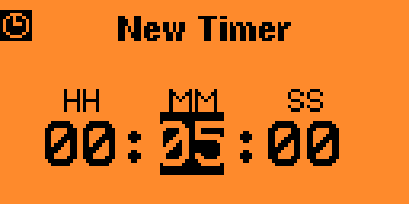
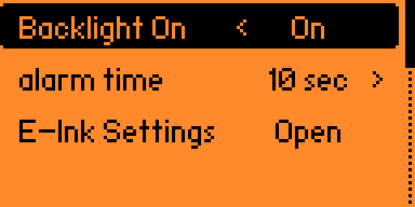
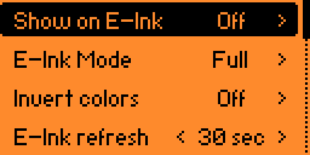

# Flipper Zero MultiTimer Ext

MultiTimer Ext is a Flipper Zero timer application with saved timer presets,
a clock screen, optional external WeActStudio e-paper output, and an
OpenSCAD enclosure parts for mounting the display with Flipper Zero.

The Flipper application id is `multitimerext`; the built file is
`dist/multitimerext.fap`.

## Features

- `Clock` screen with current time and date.
- Saved timer presets shown directly in the main menu.
- Default saved timers: `00:01:00`, `00:03:00`, `00:05:00`, `00:10:00`.
- `Add Timer` screen for creating custom saved timers.
- Up to `20` saved/active timers.
- Pause, resume, stop, and delete saved timers.
- Background timers while navigating inside the app.
- Persistent settings and saved timers.
- Optional WeActStudio black/white e-paper output over SPI.
- Selectable e-paper diagonal in `E-Ink Settings`.
- Configurable e-paper refresh interval, refresh mode, and color inversion.
- Optional always-on Flipper backlight while the app is running.
- Parametric OpenSCAD enclosure parts for the e-paper holder and adapter box.

## Screenshots

Main menu:


Add Timer:



Settings:



E-Ink settings:



Welcome screen:


## Build And Install

Install `ufbt`, then build from the repository root:

```bash
ufbt
```

The generated app is:

```text
dist/multitimerext.fap
```

To build, upload, and launch on a connected Flipper Zero:

```bash
ufbt launch
```

Close `qFlipper` and browser-based Flipper tools before using `ufbt launch`,
because they can hold the serial port.

## Main Menu

- `Clock` - shows current time and date.
- Saved timers - selecting one starts that countdown.
- `Add Timer` - creates a new saved timer and starts it.
- `Active Timers` - shows and manages currently running timers (count shown in menu).
- `Settings` - app and display settings.

## Add Timer Controls

- `Left` / `Right` - select hours, minutes, or seconds.
- `Up` / `Down` - change the selected value.
- `OK` - save the timer into the first free saved slot and start it.
- `Back` - return to the main menu.

## Running Timer Controls

- `OK` - pause or resume.
- `Back` - return to main menu (timer keeps running).
- `Left` - stop the active timer.
- `Right` - open Active Timers list.
- `Down` - while paused on a saved preset, delete that preset.

## Active Timers Controls

- `Up` / `Down` - select a timer.
- `OK` - open the selected timer.
- `Left` - stop or dismiss the selected timer.
- `Back` - return to main menu.

Delete confirmation (saved presets):

- `OK` - delete the saved timer.
- `Back` - cancel.

## Settings

Main settings:

- `Backlight On` - immediately toggles Flipper backlight behavior.
- `alarm time` - alarm duration, adjustable in 10 second steps.
- `E-Ink Settings` - opens external display settings.

E-Ink settings:

- `Show on E-Ink` - enables or disables all e-paper activity.
- `Display size` - select WeActStudio module diagonal.
- `E-Ink Mode` - `Full` or `Partial` refresh.
- `Invert colors` - toggles inverted framebuffer output.
- `E-Ink refresh` - update interval, adjustable in 10 second steps.

If `Show on E-Ink` is off, the app does not initialize or update the external
display. If the display is not connected, the app should continue working on
Flipper normally.

## WeActStudio E-Paper Support

WeActStudio sells multiple e-paper modules under the
[WeActStudio.EpaperModule](https://github.com/WeActStudio/WeActStudio.EpaperModule)
project. They use the same SPI breakout pinout, but each diagonal has a
different controller, resolution, and init sequence, so the app must know which
panel is connected.

| Menu size | Resolution | Controller | Tested on hardware |
|-----------|------------|------------|--------------------|
| `1.54" BW` | 200x200 | SSD1680 | No |
| `2.13" BW` | 128x250 | SSD1680 | No |
| `2.9" BW` | 128x296 | SSD1680 | No |
| `3.7" BW` | 240x416 | UC8253 | No |
| `4.2" BW*` | 400x300 | SSD1683 | Yes |

Default selection is `4.2" BW*`. The `*` marks the only size verified on real
hardware in this project. Other sizes are included from WeActStudio reference
init sequences and may need tuning on your exact module revision.

Only black-and-white panels are supported here. Red or 4-color WeAct variants are
not supported yet.

## E-Paper Wiring

For WeActStudio e-paper modules on Flipper GPIO:

```text
E-paper SDA  -> Flipper PA7   // SPI MOSI
E-paper CS   -> Flipper PA4
E-paper SCL  -> Flipper PB3   // SPI SCK
E-paper BUSY -> Flipper PC3

E-paper VCC  -> Flipper 3V3
E-paper GND  -> Flipper GND
E-paper RES  -> Flipper PC1
E-paper D/C  -> Flipper PC0
```

`MISO` is not used. Use `3V3`, not `5V`.

## Enclosure

OpenSCAD sources are in `enclosure/`:

```text
enclosure/eink_screen_holder.scad
enclosure/adapter_pcb_box.scad
```

Exported holder STL:

```text
enclosure/eink_screen_holder.stl
```

See `enclosure/README.md` for tunable parameters. Before printing, measure the
exact e-paper PCB dimensions and adapter board size.

## Data Storage

Saved timers and settings are stored under the app data directory:

```text
SD Card/apps_data/multitimerext/timers.dat
```

Delete this file to reset saved timers and settings.

## Development

Requirements:

- `ufbt`
- Flipper Zero firmware compatible with the target API used by `ufbt`
- OpenSCAD, only if editing/exporting the enclosure

Useful commands:

```bash
ufbt
ufbt launch
openscad -o enclosure/eink_screen_holder.stl enclosure/eink_screen_holder.scad
```

## License

This project is licensed under the MIT License. See `LICENSE`.
